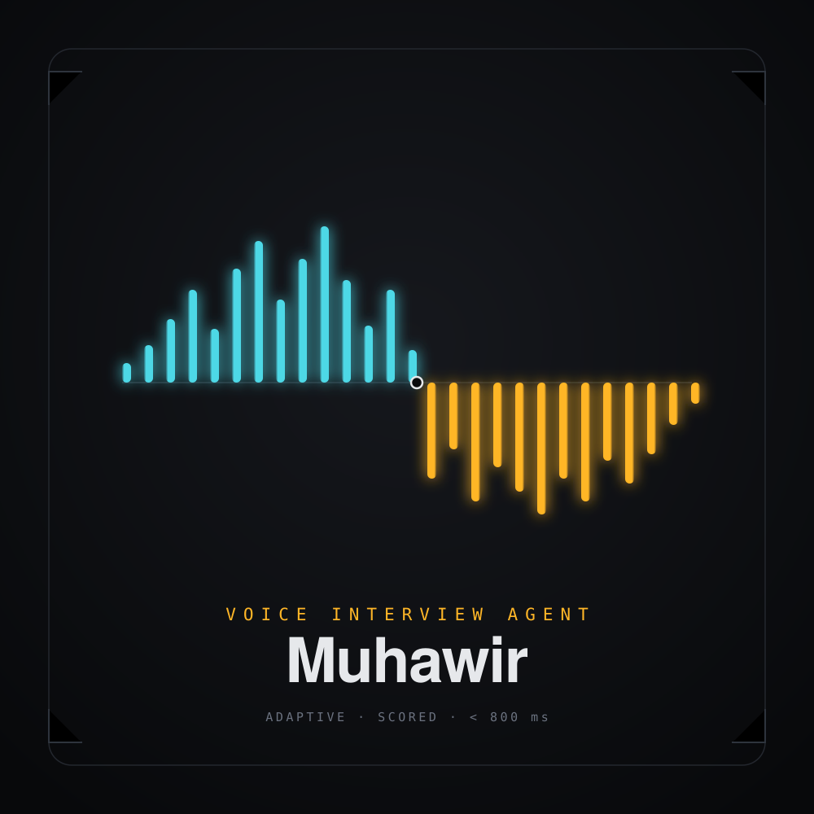

# Muhawir — Voice Interview Agent

A real-time voice interviewer that adapts its questions to the candidate's
answers and produces a scored, per-dimension report at the end of the call.

Built on Pipecat 1.6 with WebRTC transport, Groq for speech-to-text and
conversation, and Cartesia for speech synthesis.

---

## Why this is not a Streamlit app

Real-time bidirectional audio needs a peer connection that stays open for
the duration of the call. Streamlit re-runs its script on every interaction,
so it cannot hold one. The transport here is WebRTC over FastAPI, which is
also what makes echo cancellation, jitter buffering, and packet-loss
concealment available for free from the browser.

---

## Architecture

```
browser ──WebRTC──▶ transport.in ─▶ VAD ─▶ STT ─▶ user ctx ─▶ LLM ─▶ TTS ─▶ transport.out
                                                              │
                                                     ┌────────┴────────┐
                                                     │ transcript tap  │  (passive)
                                                     └────────┬────────┘
                                                              │ fire-and-forget
                                                       background scorer
                                                              │
                                                        JSON + Markdown report
```

The scorer never sits inside the pipeline. Anything placed between STT and
TTS is paid for in latency on every turn, so only the three services that
must be inline are inline.

---

## Latency budget

Target: under 800 ms from the candidate falling silent to the first audio
of the reply. Measured per turn and reported as a median in every report.

| Stage | Budget | Notes |
| --- | --- | --- |
| Silence detection (VAD) | 200–400 ms | `VAD_STOP_SECS` — the biggest lever you control |
| Speech-to-text | 100–200 ms | Groq Whisper turbo |
| First token from the LLM | 100–300 ms | Groq's advantage lives here |
| First audio from TTS | 40–100 ms | Cartesia streams over WebSocket |

Tune `VAD_STOP_SECS` before anything else. Too low and the agent talks over
a candidate who is still thinking; too high and every reply drags.

---

## Engineering decisions

| Decision | Why | Trade-off accepted |
| --- | --- | --- |
| Cascade (STT→LLM→TTS) over speech-to-speech | Each stage is inspectable and swappable; scoring needs the text | Slightly higher latency than a native realtime model |
| Scoring off the voice loop | Evaluation quality shouldn't cost response time | Report finalises a few seconds after the call ends |
| Rubric as data, not prose | Versionable, testable, and presentable to a client | More code than one "rate this out of ten" prompt |
| Per-dimension scores with justification | A single number is unfalsifiable | More tokens per evaluation |
| WebRTC over WebSocket audio | Echo cancellation and loss concealment come free | More signalling complexity |

---

## Running it

```bash
pip install -r requirements.txt
cp .env.example .env      # add your Groq and Cartesia keys and a voice id
python server.py          # http://localhost:7860
```

Reports are written to `reports/<session_id>.{json,md}` when the call ends.

---

## Configuration

Everything is environment-driven. The ones that matter most:

- `INTERVIEW_ROLE` / `INTERVIEW_LEVEL` — what the agent interviews for
- `MAX_QUESTIONS` — call length
- `VAD_STOP_SECS` — turn-taking feel

---

## Not yet built

Honest list, in the order worth doing:

1. **Evals.** A fixed set of recorded answers with expected score ranges,
   so a prompt change can be shown to help or hurt rather than argued about.
2. **Resume upload.** Parse a PDF and seed the interview from real experience
   instead of a job title.
3. **Persistence.** Sessions live in memory; a database turns this into a
   product with history and progress tracking.
4. **Cost telemetry.** Per-call token and audio-second accounting.
5. **Barge-in tuning.** Interruption works, but the thresholds are untested
   against noisy environments.
